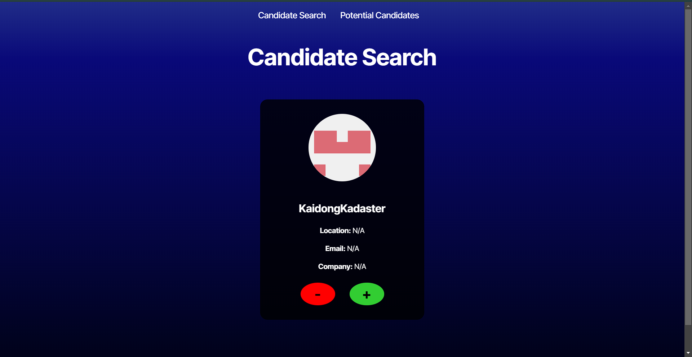

# 🌟 Candidate Search App

Welcome to Candidate Search, an application built with React and TypeScript that lets employers easily search for potential candidates by fetching data from the GitHub API. This project demonstrates how TypeScript enhances development for more reliable, maintainable, and scalable applications. 🚀

---

## 📸 Preview



---

## 🔗 Live Demo

Check out the live demo on [Render](https://render.com/) or your preferred hosting platform.

---

## 📌 Features

- ✅ **Candidate Display:** Shows candidate's name, username, location, avatar, email, GitHub profile link (`html_url`), and company.
- ✅ **Accept or Reject:** Use the "+" button to save a candidate and the "-" button to skip to the next candidate.
- ✅ **Persistent Storage:** Saved candidates are stored in local storage and persist across page reloads.
- ✅ **Responsive Design:** Works seamlessly on all devices 📱💻
- ✅ **API Integration:** Seamlessly calls a pre-built API that retrieves data from the GitHub API.
- ✅ **Bonus (Optional):** Sorting and filtering of candidates.

---

## 🛠️ Built With

- **React** – Modern UI development
- **TypeScript** – Ensures type safety and better development experience
- **Vite** – Fast development environment
- **CSS** – Styling the application
- **Local Storage** – Data persistence
- **GitHub API** – Source of candidate data

---

## 📂 Project Structure

candidate-search/ ├── public/ # Static assets (images, icons, etc.) │ └── assets/ │ └── images/ # Screenshots & images ├── src/ # React components & pages │ ├── api/ # API calls and integrations │ │ └── API.tsx │ ├── components/ # Reusable UI components │ ├── pages/ # Main pages (CandidateSearch, SavedCandidates, etc.) │ ├── App.tsx # Main App component │ └── index.tsx # React entry point ├── .env # Environment variables (GitHub token) ├── .env.EXAMPLE # Example environment file ├── package.json # Dependencies & scripts └── README.md # Project documentation

## 🚀 Installation & Setup

1️⃣ **Clone the Repository**
git clone https://github.com/Outsideofemit/candidate-search.git
cd candidate-search


3️⃣ Install Dependencies
npm install

4️⃣ Setup Environment Variables

Create a .env file in the root of your project (or in the designated environment folder).
Copy the contents from .env.EXAMPLE.
Add your GitHub Personal Access Token by setting:
env
VITE_GITHUB_TOKEN=your_personal_access_token_here
Note: The token is only viewable once, so be sure to save it securely.

5️⃣ Run the Development Server
npm run dev
Then, open http://localhost:3000 (or the configured port) in your browser.

📁 Deployment
This application can be deployed on platforms like:

Render
Netlify
Vercel
For deployment, follow the provider's documentation and ensure you set the VITE_GITHUB_TOKEN environment variable in the service settings.

📬 Contact
If you’d like to collaborate or have any questions, feel free to reach out!

Email: outsideofemit@gmail.com
GitHub: @outsideofemit
LinkedIn: linkedin.com/in/carmendwheeler

Feel free to customize the links, contact details, and preview sections to fit your project details perfectly!
=======
# Candidate Search

A Candidate Search application built with React and TypeScript that utilizes the GitHub API to retrieve candidate data. This project demonstrates how TypeScript enhances the development experience, leading to more reliable, maintainable, and scalable applications.

## Table of Contents

- [Overview](#overview)
- [Features](#features)
- [Technologies Used](#technologies-used)
- [Installation](#installation)
- [Usage](#usage)
- [Deployment](#deployment)
- [Bonus Features](#bonus-features)
- [License](#license)
- [Acknowledgements](#acknowledgements)

## Overview

The Candidate Search app allows employers to review potential candidates by displaying their profile information fetched from the GitHub API. Users can save candidates for further review or simply move on to the next candidate. The application ensures a smooth user experience by persisting saved candidate data using local storage.

## Features

- **Candidate Display:** Shows candidate's name, username, location, avatar, email, GitHub profile link (`html_url`), and company.
- **Accept or Reject:** Use the "+" button to save a candidate or the "-" button to skip to the next candidate.
- **Persistent Storage:** Saved candidates are stored in local storage and persist across page reloads.
- **Responsive UI:** A user-friendly interface for both the candidate search page and the list of saved candidates.
- **API Integration:** Seamlessly integrates with the GitHub API via an intermediary API that handles the calls and data retrieval.

## Technologies Used

- **React:** Front-end library for building the UI.
- **TypeScript:** Provides static typing to enhance code quality and maintainability.
- **CSS:** For styling the application.
- **Local Storage:** For data persistence of saved candidates.
- **GitHub API:** Source of candidate data.
- **Render:** Deployment platform for hosting the application.

## Installation

1. **Clone the Repository**

   ```bash
   git clone https://github.com/yourusername/candidate-search.git
   cd candidate-search
Download Starter Code

Ensure that you have downloaded and unzipped the starter code files as provided in the assignment instructions.

Install Dependencies

Install the necessary dependencies by running:

bash
Copy
npm install
Setup Environment Variables

Create a .env file in the root of your project (or in the appropriate environment folder).

Copy the contents from the provided .env.EXAMPLE file.

Add your GitHub Personal Access Token by setting:

env
Copy
VITE_GITHUB_TOKEN=your_personal_access_token_here
Note: You will not be able to view your token after creation, so ensure you copy and store it securely.

Usage
Start the Development Server

Run the following command to start the development server:

bash
Copy
npm run dev
Your application will be available at http://localhost:3000 (or another port if configured).

Candidate Search

On the candidate search page, review the displayed candidate information.
Click the "+" button to save a candidate to your potential candidates list.
Click the "-" button to skip to the next candidate without saving.
Viewing Saved Candidates

Navigate to the Saved Candidates page to see a list of all candidates you have accepted.
The list will persist even if you reload the page.
Deployment
The application is designed to be deployed on Render. For deployment:

Deploy on Render

Follow the Render documentation for deploying React applications.

Setting Environment Variables on Render

Go to your Render dashboard.
Set the VITE_GITHUB_TOKEN environment variable in the Render service settings.
Deploy the application following the provided guidelines.
Bonus Features
As an enhancement, consider implementing the following bonus features:

Sorting: Allow users to sort the list of potential candidates based on criteria such as name, location, or company.
Filtering: Add filter options to help narrow down the candidate list based on specific attributes.
License
This project is licensed under the MIT License.

Acknowledgements
Thanks to the course instructors and materials for providing the starter code and guidance.
Special thanks to the GitHub API documentation for comprehensive guidelines on data retrieval.
pgsql
Copy

Feel free to modify any sections to better suit your project specifics!
* Optionally, add `plugin:@typescript-eslint/stylistic-type-checked`.
* Install [eslint-plugin-react](https://github.com/jsx-eslint/eslint-plugin-react) and add `plugin:react/recommended` and `plugin:react/jsx-runtime` to the `extends` list.

---
© 2024 edX Boot Camps LLC. Confidential and Proprietary. All Rights Reserved.

```

* Replace `plugin:@typescript-eslint/recommended` with `plugin:@typescript-eslint/recommended-type-checked` or `plugin:@typescript-eslint/strict-type-checked`.
* Optionally, add `plugin:@typescript-eslint/stylistic-type-checked`.
* Install [eslint-plugin-react](https://github.com/jsx-eslint/eslint-plugin-react) and add `plugin:react/recommended` and `plugin:react/jsx-runtime` to the `extends` list.

---
© 2024 edX Boot Camps LLC. Confidential and Proprietary. All Rights Reserved.
`.
* Install [eslint-plugin-react](https://github.com/jsx-eslint/eslint-plugin-react) and add `plugin:react/recommended` and `plugin:react/jsx-runtime` to the `extends` list.

---
© 2024 edX Boot Camps LLC. Confidential and Proprietary. All Rights Reserved.
>>>>>>> 921288568d069511fcc75ffd2277b675f8c3664b
